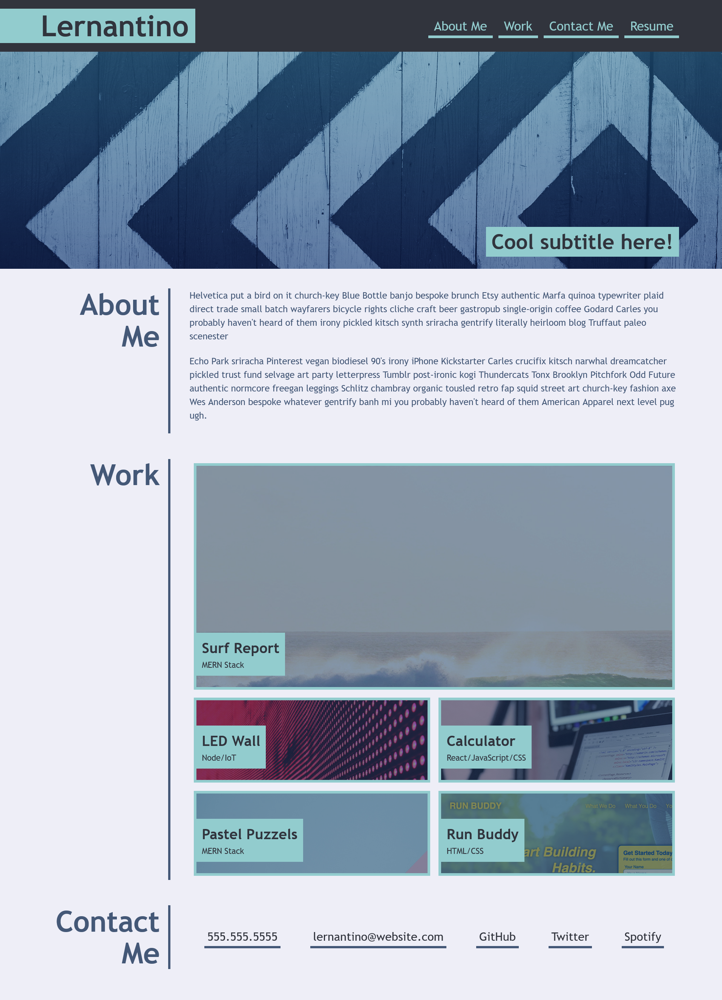

# HTML & CSS PORTFOLIO STYLING 

## Description

The aim of this weeks challenge was to use what we had learnt of flexbox and Grid CSS layout to create our very own Portfolio using only HTML & CSS

Below are the user stories and acceptance criteria for this task:

### Acceptance Criteria

Here are the critical requirements necessary to develop a portfolio that satisfies a typical hiring manager’s needs:

* When the page is loaded the page presents your name, a recent photo or avatar, and links to sections about you, your work, and how to contact you
* When one of the links in the navigation is clicked then the UI scrolls to the corresponding section
* When viewing the section about your work then the section contains titled images of your applications
* When presented with the your first application then that application's image should be larger in size than the others
* When images of the applications are clicked then the user is taken to that deployed application
* When the page is resized or viewed on various screens and devices then the layout is responsive and adapts to my viewport

## Task
The task was to get a close to the design as possible in layout:

 However,flexiblity was granted with aesthetics. 

## Workflow 
Once again this was a simple task that could of be curated from the main branch. Nevertheless, I wanted to keep a version history so split the workload into two tickets/branches:
1. feature/HTML
2. feature/CSS
which were eventually merged to main. 

## Installation
The challenge is deployed using Github Pages. The end result can be found here: 
When viewing through the editor ensure live server is installed in order to run the portfolio.html file in the browswer. 

## License 
MIT

